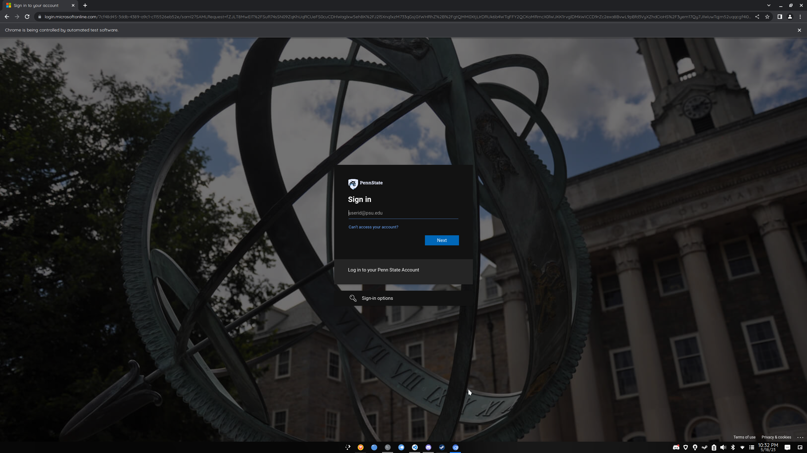

# LionPath Sniper
<div align="left" width="100%">
    
</div>

LionPath Sniper is an open-source easy-to-use Python auto register script for LionPath.



Features
--
- Automatic course enrollment (enroll in courses automatically when they open)
- Automatic 2FA support (automatically enters 2FA code when prompted)
- Wait until 12AM (waits until course registration opens at 12AM)
- Error handling (restarts script if there is an error logging in, so you can sleep peacefully)
- Idle timeout handling (automatically stays logged in to LionPath when a "Your session is about to expire" prompt appears)
- Multi-platform support (Windows, Mac, Linux)
- Dark Mode (sets the browser to dark mode as well as the LionPath website)
- Automatically detects the amount of classes you want to enroll in
- Discord Integration (Send enrollment results to Discord via a webhook)
- 100% free and open-source

Installation
--
1. Python is required to run this script. If you do not have Python installed, you can download it [here](https://www.python.org/downloads/).
2. Clone this repository or download the zip file and extract it.
3. Run the following commands in a terminal:
```
python3 setup.py
```
You will be taken through the setup process where you will be asked to provide your LionPath credentials, the semester you want to select, and other options.

Usage
--
Once the setup is complete, run the following command in a terminal:
```
python3 main.py
```
The script will now run and automatically enroll you in your courses when they open.

Configuration
--
You can configure the script by editing the `config.py` file. The following options are available:
- `radnum`: Which semester to enroll in (which radio button to click starting from 1)
- `waitUntil12AM`: Wait for 12AM to enroll (for waiting for registration to open)
- `waitTimerEnable`: Wait until 3 minutes before 12AM to start the script (saves resources, but you can disable this to run the script manually)
- `restartOnError`: Restart the script if an error occurs (for example, if you get logged out of LionPath)
- `darkMode`: Dark Mode (sets the browser to dark mode, also sets the LionPath website to dark mode)
- `useTOTP`: TOTP Support for 2FA (TOTP must be enabled and set as the default method on your Microsoft account for this to work)
- `useBrave`: Brave Browser Support
- `useEdge`: Microsoft Edge Support
- `sendDiscordNotification`: Discord Webhook Integration (sends enrollment results to Discord via a webhook)
- `discordWebhookURL`: Discord Webhook URL (the webhook URL to send enrollment results to)

Discord Integration
--
This script is configured to send your enrollment results to Discord via a webhook. To enable this feature, you must first create a webhook in a Discord server. To do this, follow the steps below:
1. Open Discord and navigate to the server you want to send the enrollment results to.
2. Click the settings icon next to the server name and click "Integrations".
3. Click "Create Webhook".
4. Enter a name for the webhook and click "Copy Webhook URL".
5. Paste the webhook URL into the `discordWebhookURL` option in the `config.py` file.

Star me on GitHub!
--
If you like this project and found it useful, please consider giving it a star on GitHub and sharing it with your friends!